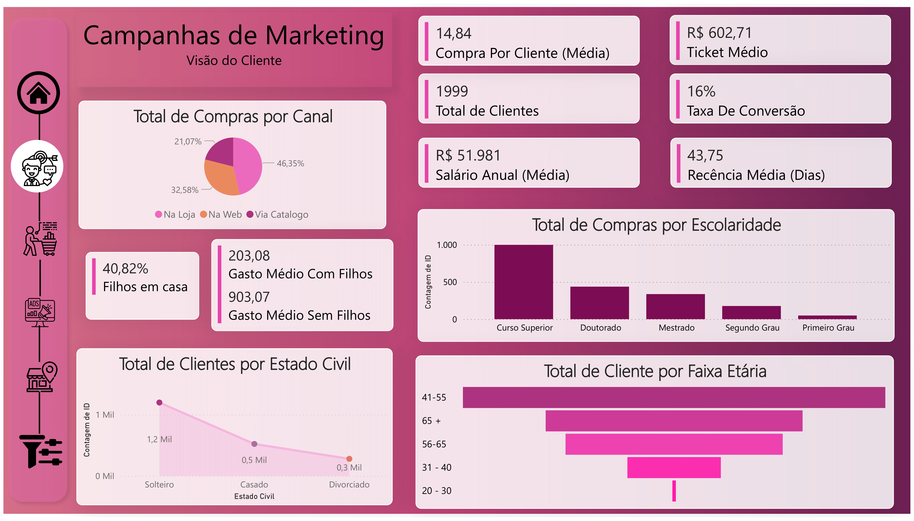

# 🧠 Insights – Customer Overview

> **Most customers are single, have a college degree, and are between 41 and 55 years old — a profile with high campaign engagement and strong presence in physical stores.**

---

## 🎯 Overview

This section analyzes the demographic and socioeconomic profile of the customers to understand the main behavioral patterns of the audience.

The evaluated sample includes **1,999 customers**, with an average annual income of **R$ 51,981**, and an average recency of **43 days** since their last purchase.

---

## 📊 Key Metrics

| Metric                       | Value         |
|-----------------------------|---------------|
| Total Customers             | 1,999         |
| Annual Salary (Average)     | R$ 51,981     |
| Purchases per Customer      | 14.84         |
| Average Ticket              | R$ 602.71     |
| Overall Conversion Rate     | 16%           |
| Average Recency             | 43.75 days    |
| Customers with Children     | 40.82%        |
| Avg. Spend – With Children  | R$ 203.08     |
| Avg. Spend – No Children    | R$ 903.07     |

---

## 🧩 Segmented Analysis

- Most customers have **college education** (~50%) and are **single** (60%)
- The dominant age group is **41–55**
- **Customers without children** account for most spending, with an average ticket almost **4.5x higher** than those with children
- **Most purchases are made in physical stores** (46%), followed by discount and web channels

---

## 💡 Strategic Recommendations

- Focus campaigns on **single, college-educated customers over 40**
- Create personalized campaigns for **customers with children**, aiming to increase engagement and average ticket
- Further explore behavior by **country and income**, as slicers enable additional insights

---

*This report refers to the “Customer Overview” section only. Next pages will cover purchasing behavior, campaign performance, and point-of-sale trends.*
