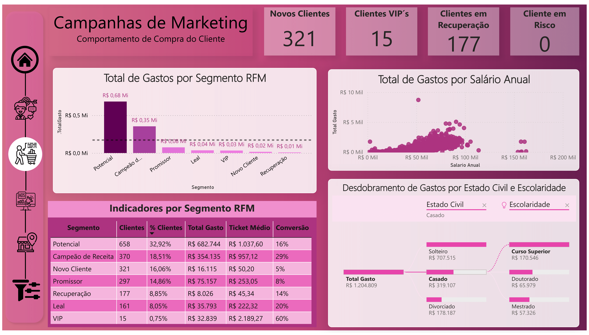
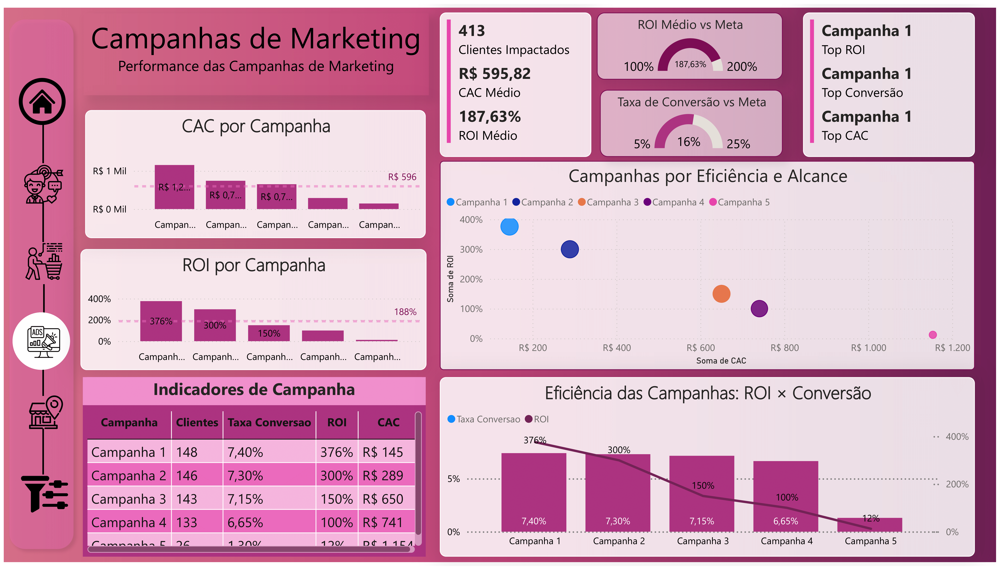
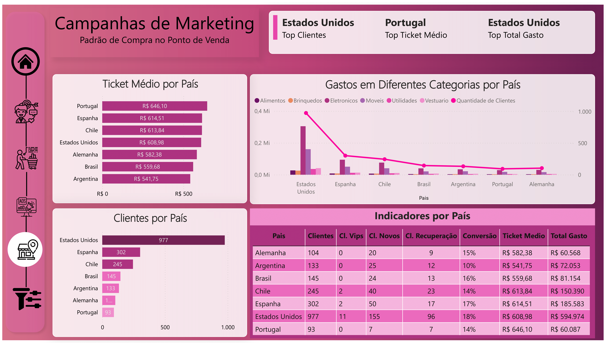

# 🧠 Insights – Customer Overview

> **Most customers are single, have a college degree, and are between 41 and 55 years old — a profile with high campaign engagement and strong presence in physical stores.**

---

## 🎯 Overview

This section analyzes the demographic and socioeconomic profile of the customers to understand the main behavioral patterns of the audience.

The evaluated sample includes **1,999 customers**, with an average annual income of **R$ 51,981**, and an average recency of **43 days** since their last purchase.

---

## 📊 Key Metrics

| Metric                       | Value         |
|-----------------------------|---------------|
| Total Customers             | 1,999         |
| Annual Salary (Average)     | R$ 51,981     |
| Purchases per Customer      | 14.84         |
| Average Ticket              | R$ 602.71     |
| Overall Conversion Rate     | 16%           |
| Average Recency             | 43.75 days    |
| Customers with Children     | 40.82%        |
| Avg. Spend – With Children  | R$ 203.08     |
| Avg. Spend – No Children    | R$ 903.07     |

---

## 🧩 Segmented Analysis

- Most customers have **college education** (~50%) and are **single** (60%)
- The dominant age group is **41–55**
- **Customers without children** account for most spending, with an average ticket almost **4.5x higher** than those with children
- **Most purchases are made in physical stores** (46%), followed by discount and web channels

---

## 💡 Strategic Recommendations

- Focus campaigns on **single, college-educated customers over 40**
- Create personalized campaigns for **customers with children**, aiming to increase engagement and average ticket
- Further explore behavior by **country and income**, as slicers enable additional insights

---

---

# 🧠 Insights – Customer Purchase Behavior

> **Customers in the "Potential" and "Revenue Champion" segments account for over 50% of total spending, making them top priorities for retention and upsell campaigns.**

---

## 🎯 Overview

This page analyzes customer behavior using the RFM (Recency, Frequency, Monetary) segmentation model, allowing us to identify strategic customer profiles based on their engagement and purchase patterns.

---

## 📊 Key Metrics by Segment

| Segment               | Customers | % of Total | Total Spend | Avg. Ticket | Conversion |
|------------------------|----------:|-----------:|-------------:|-------------:|-----------:|
| Potential              |       658 |     32.9%  |  R$ 682,744  |   R$ 1,037.60 |       16% |
| Revenue Champion       |       370 |     18.5%  |  R$ 354,135  |     R$ 957.12 |       29% |
| New Customer           |       321 |     16.1%  |   R$ 16,115  |      R$ 50.20 |        5% |
| Promising              |       297 |     14.9%  |   R$ 75,157  |     R$ 253.05 |        8% |
| Recovery               |       177 |      8.9%  |    R$ 8,026  |      R$ 45.34 |       14% |
| Loyal                  |       161 |      8.1%  |   R$ 35,793  |     R$ 222.32 |       20% |
| VIP                    |        15 |      0.8%  |   R$ 32,839  |   R$ 2,189.27 |       60% |

---

## 🔍 Key Findings

- **Potential** and **Revenue Champion** segments represent **over half of total revenue**, making them strategic targets for personalized offers.
- The **VIP** group, although small, shows the **highest average ticket and conversion rate**, ideal for exclusive programs.
- The **Recovery** segment presents an opportunity for re-engagement through targeted remarketing.
- Cross-analysis of **recency and frequency** shows that high-value customers tend to buy more often and more recently.

---

## 💡 Strategic Recommendations

- Design specific **upsell campaigns for Potential and Champion segments**
- Launch **exclusive initiatives for VIPs**, such as loyalty programs and early-access perks
- Create **win-back flows for Recovery customers**, using incentives and targeted messages
- Combine behavior with demographics like **age, children at home, or purchase channel** for more refined segmentation

---

---

# 🧠 Insights – Marketing Campaign Performance

> **Campaign 1 outperformed all others in efficiency, delivering the highest ROI (376%), highest conversion rate (7.4%), and the lowest CAC (R$ 145).**

---

## 🎯 Overview

This section evaluates the performance of marketing campaigns based on three key metrics: **ROI (Return on Investment), CAC (Customer Acquisition Cost)**, and **Conversion Rate**, allowing us to identify the most effective strategies with the highest impact.

---

## 📊 Key Indicators

| Metric                     | Value          |
|---------------------------|----------------|
| Impacted Clients          | 413            |
| Average CAC               | R$ 595.82      |
| Average ROI               | 187.63%        |
| Overall Conversion Rate   | 16%            |
| Top ROI Campaign          | Campaign 1     |
| Top Conversion Campaign   | Campaign 1     |
| Lowest CAC Campaign       | Campaign 1     |

---

## 🔍 Key Findings

- **Campaign 1** stands out in every aspect: it generated the **highest ROI**, had the **lowest CAC**, and achieved the **best conversion rate** among all campaigns.
- **Campaign 5** underperformed with a **low ROI (12%)**, **high CAC (R$ 1,154)**, and **poor conversion rate (1.3%)**.
- The **ROI vs CAC scatter plot** reveals a clear trend: **lower CAC tends to be associated with higher ROI**.
- The **column + line chart** illustrates the relationship between ROI and Conversion Rate, highlighting that **efficiency is not only about volume** but also about strategy.
- The **campaign performance matrix** provides a comprehensive side-by-side comparison of each campaign’s KPIs.

---

## 💡 Strategic Opportunities

- **Scale or replicate Campaign 1’s approach**, as it proved highly efficient and profitable.
- **Reassess Campaigns 4 and 5** to understand the low performance — improvements could include better segmentation, channel selection, or message alignment.
- **Establish clear performance targets**, such as ROI > 200% and Conversion Rate > 25%, and track progress with dashboards.
- Consider **customizing campaigns by customer segment**, leveraging the RFM segmentation for more effective targeting.
- **New improvement opportunity**: it is now possible to **filter the campaign analysis by RFM segment**, enabling deeper insights. However, this feature currently introduces visual gaps where no matching data exists. Addressing this limitation could greatly enhance the dashboard's intelligence in future versions.

------
# 🧠 Insights – Purchase Patterns at Point of Sale

> **The United States leads in number of customers and total spending, while Portugal has the highest average ticket per customer.**

---

## 🎯 Overview

This section explores **purchase patterns by country**, analyzing differences in total customers, average ticket size, and overall spend across geographies.

⚠️ *Note*: No time-based analysis was performed due to data limitations — the dataset only includes registration and last purchase dates, with no consistent timeline of transactions. This is a limitation to be improved in future data collections.

---

## 📊 Key Indicators

| Metric                      | Value              |
|----------------------------|--------------------|
| Country with most clients  | **United States**  |
| Country with highest ticket| **Portugal**        |
| Country with highest spend | **United States**  |

---

## 🔍 Key Insights

- The **United States** holds **nearly half the customer base** and leads in total spend, surpassing R$ 590K.
- However, **Portugal stands out** with the **highest average ticket** (R$ 646.10), indicating a smaller but high-value customer base.
- **Spain and Chile** also show strong purchasing power with average tickets above R$ 600.
- Spending by category shows that **Electronics dominate** in every country, followed by Furniture and Toys.
- When filtered by age group (e.g., 20–30 years), the **customer base decreases significantly**, and spend distribution shifts — reinforcing the importance of segmentation in marketing efforts.

---

## 💡 Strategic Recommendations

- **Expand campaigns in countries with higher average spend**, such as Portugal and Spain, to grow the customer base in premium markets.
- **Sustain investment in the United States**, leveraging its large customer base and overall purchasing volume.
- **Target younger age groups** (e.g., 20–30) with tailored offers, as they currently represent a lower but potentially valuable segment.
- **Explore diversification across product categories**, especially for cross-selling alongside the dominant Electronics segment.

---
