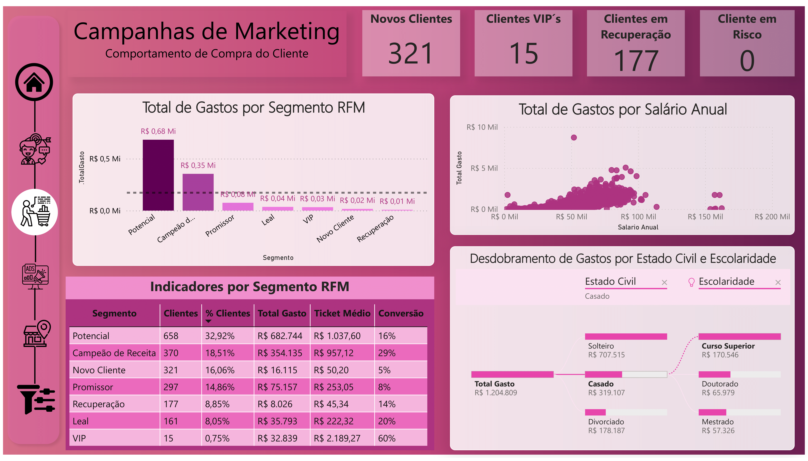
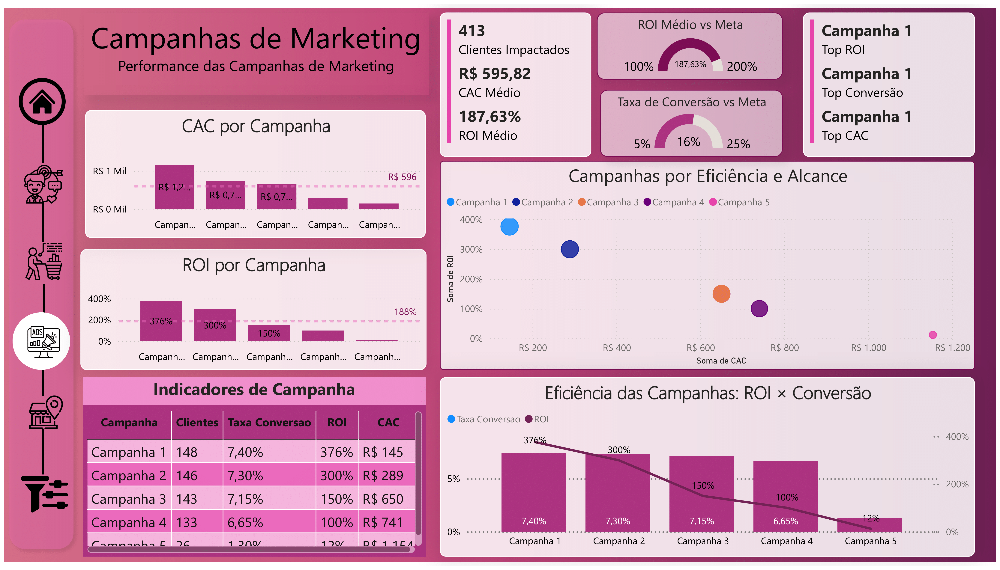
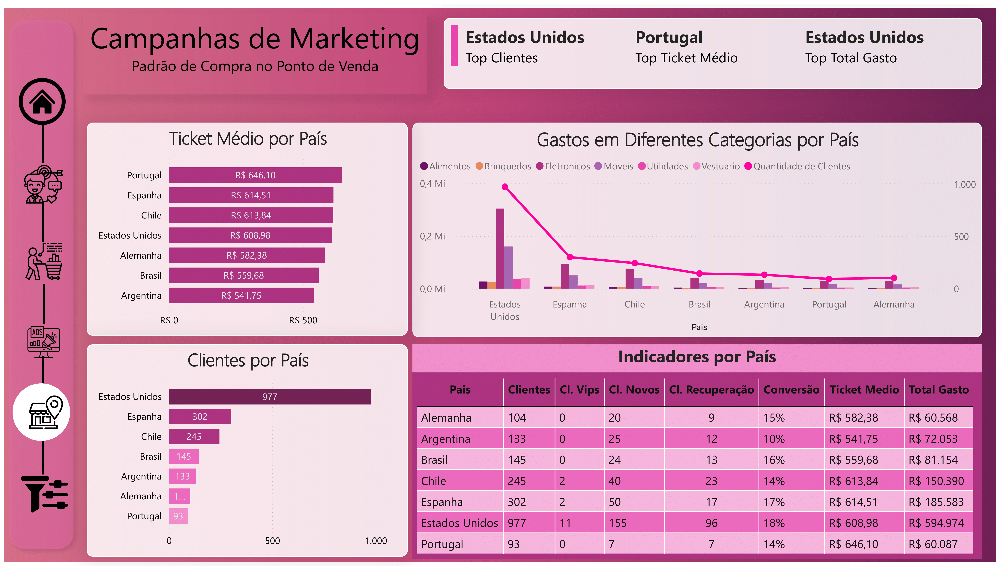

# 🧠 Insights – Visão Cliente

> **A maioria dos clientes é solteira, possui ensino superior e está na faixa etária entre 41 e 55 anos — um perfil com alto engajamento em campanhas e forte presença em lojas físicas.**

---

## 🎯 Visão Geral

Esta aba explora o perfil demográfico e socioeconômico dos clientes, com o objetivo de compreender o público-alvo e suas principais características de consumo.

A amostra avaliada contém **1.999 clientes**, com salário anual médio de **R$ 51.981**, e uma **recência média de 43 dias** desde a última compra.

---

## 📊 Indicadores-chave

| Métrica                      | Valor         |
|-----------------------------|---------------|
| Total de Clientes           | 1.999         |
| Salário Anual (Média)       | R$ 51.981     |
| Compras por Cliente (Média) | 14,84         |
| Ticket Médio                | R$ 602,71     |
| Taxa de Conversão Geral     | 16%           |
| Recência Média              | 43,75 dias    |
| Clientes com Filhos         | 40,82%        |
| Gasto Médio com Filhos      | R$ 203,08     |
| Gasto Médio sem Filhos      | R$ 903,07     |

---

## 🧩 Análises Segmentadas

- A maioria dos clientes possui **ensino superior** (cerca de 50%) e é **solteira** (60%)
- O maior grupo etário é de **41 a 55 anos**
- **Clientes sem filhos** representam a maior parte dos gastos totais, com um ticket médio **quase 4,5x maior** que os clientes com filhos
- **A maior parte das compras ocorre em lojas físicas** (46%), seguida por canais com desconto e web

---

## 💡 Possíveis Ações Estratégicas

- Foco em campanhas para o público **solteiro, com ensino superior e mais de 40 anos**
- Criação de campanhas personalizadas para **clientes com filhos**, buscando aumentar o engajamento e o ticket médio
- Análise futura de comportamento por país e renda, já que os dados filtráveis permitem novas descobertas

---

---

# 🧠 Insights – Comportamento de Compra do Cliente

> **Clientes nos segmentos “Potencial” e “Campeão de Receita” concentram mais de 50% do gasto total, indicando que são o público prioritário para campanhas de retenção e upsell.**

---

## 🎯 Visão Geral

Esta aba analisa o comportamento de compra dos clientes por meio da segmentação RFM (Recência, Frequência e Valor Monetário), permitindo identificar perfis estratégicos com base na sua jornada e engajamento.

---

## 📊 Indicadores-chave por Segmento

| Segmento                | Clientes | % Clientes | Total Gasto | Ticket Médio | Conversão |
|-------------------------|---------:|-----------:|------------:|-------------:|----------:|
| Potencial               |      658 |     32,9%  |  R$ 682.744 |    R$ 1.037,60 |      16% |
| Campeão de Receita      |      370 |     18,5%  |  R$ 354.135 |      R$ 957,12 |      29% |
| Novo Cliente            |      321 |     16,1%  |   R$ 16.115 |       R$ 50,20 |       5% |
| Promissor               |      297 |     14,9%  |   R$ 75.157 |      R$ 253,05 |       8% |
| Em Recuperação          |      177 |      8,9%  |    R$ 8.026 |       R$ 45,34 |      14% |
| Leal                    |      161 |      8,1%  |   R$ 35.793 |      R$ 222,32 |      20% |
| VIP                     |       15 |      0,8%  |   R$ 32.839 |    R$ 2.189,27 |      60% |

---

## 🔍 Análises Relevantes

- Os segmentos **Potencial** e **Campeão de Receita** concentram **mais da metade do gasto total**, sendo os mais estratégicos para retenção e ofertas personalizadas.
- O segmento **VIP**, apesar de pequeno, tem **o maior ticket médio e taxa de conversão**, sendo ideal para programas exclusivos de fidelização.
- O grupo **Em Recuperação** representa uma oportunidade de reengajamento com ações de remarketing direcionadas.
- A distribuição de **recência e frequência** revela que clientes com maior valor monetário tendem a comprar com mais frequência e menor intervalo entre compras.

---

## 💡 Possíveis Ações Estratégicas

- Criar campanhas específicas de **upsell para os segmentos Potencial e Campeão**
- Lançar **ações exclusivas para o grupo VIP**, incluindo programas de fidelidade, brindes e pré-lançamentos
- Investir em **fluxos de reativação para o grupo Em Recuperação**, como descontos personalizados ou recompensas por retorno
- Avaliar o comportamento de compra cruzado com variáveis como **faixa etária, filhos em casa ou canal de compra**, para segmentações ainda mais precisas

---
---

# 🧠 Insights – Performance das Campanhas de Marketing

> **A Campanha 1 superou todas as demais em eficiência: apresentou o maior ROI (376%), a maior taxa de conversão (7,4%) e o menor CAC (R$ 145).**

---

## 🎯 Visão Geral

Esta aba analisa o desempenho das campanhas de marketing com base em três métricas principais: **ROI (Retorno sobre o Investimento), CAC (Custo de Aquisição de Cliente)** e **Taxa de Conversão**, permitindo identificar quais estratégias foram mais eficientes e com maior impacto.

---

## 📊 Indicadores-chave

| Métrica                    | Valor          |
|---------------------------|----------------|
| Clientes Impactados       | 413            |
| CAC Médio                 | R$ 595,82      |
| ROI Médio                 | 187,63%        |
| Taxa de Conversão Geral   | 16%            |
| Campanha com Maior ROI    | Campanha 1     |
| Campanha com Maior Conversão | Campanha 1  |
| Campanha com Menor CAC    | Campanha 1     |

---

## 🔍 Análises Relevantes

- A **Campanha 1** é a mais eficiente: além de alcançar **o maior retorno (ROI)**, também foi **a mais econômica em termos de aquisição de clientes (menor CAC)** e converteu **a maior proporção de clientes**.
- A **Campanha 5**, por outro lado, teve o **menor desempenho geral**, com ROI de apenas 12%, CAC elevado (R$ 1.154) e baixa taxa de conversão (1,3%).
- O **gráfico de dispersão** entre ROI e CAC evidencia uma relação clara: **campanhas com CAC mais baixos tendem a apresentar ROI mais altos**.
- O gráfico de linha + colunas mostra como **a eficiência (ROI)** se relaciona com a **capacidade de conversão**, reforçando que bons resultados não dependem apenas de volume de clientes impactados.
- O painel de **indicadores consolidados por campanha** fornece uma visão completa para comparação direta entre as ações.

---

## 💡 Possíveis Ações Estratégicas

- **Repetir ou escalar estratégias da Campanha 1**, que demonstrou alta eficiência e retorno.
- **Revisar as estratégias das Campanhas 4 e 5**, buscando entender os motivos dos baixos retornos e altos CACs — possíveis melhorias incluem segmentação, abordagem ou canais utilizados.
- **Definir metas claras de ROI (200%) e conversão (25%)** e acompanhar a evolução dessas métricas com painéis de monitoramento contínuo.
- Considerar **ações específicas por segmento de cliente**, integrando os dados da aba anterior para campanhas ainda mais direcionadas.
- **Nova melhoria possível**: agora é possível **filtrar os resultados por segmento RFM**, o que permite análises mais profundas. No entanto, o uso desse recurso ainda gera vazios visuais devido à ausência de dados cruzados em alguns pontos. Corrigir essa limitação será uma **ótima evolução futura** para tornar o dashboard ainda mais inteligente.

---
# 🧠 Insights – Padrões de Compra no Ponto de Venda

> **Estados Unidos lideram em número de clientes e em volume total de gastos, enquanto Portugal apresenta o maior ticket médio por cliente.**

---

## 🎯 Visão Geral

Esta aba analisa o padrão de comportamento dos clientes nos pontos de venda, com foco em **diferenças por país** em relação ao número de clientes, ticket médio e volume total gasto.

⚠️ *Importante*: não foram realizadas análises temporais, pois os dados disponíveis não incluem datas de compra detalhadas — apenas a data de inscrição e a última compra. Esse é um ponto a ser melhorado em futuras coletas.

---

## 📊 Indicadores-chave

| Métrica                     | Valor             |
|----------------------------|-------------------|
| País com mais clientes     | **Estados Unidos** |
| País com maior ticket médio| **Portugal**       |
| País com maior gasto total | **Estados Unidos** |

---

## 🔍 Análises Relevantes

- **Estados Unidos** concentram **quase metade de todos os clientes** da base e lideram também em gasto total, com mais de R$ 590 mil.
- Apesar disso, o **ticket médio mais alto está em Portugal** (R$ 646,10), indicando que embora o país tenha menos clientes, seu poder de compra é elevado.
- **Espanha e Chile** também se destacam com tickets médios acima de R$ 600, sugerindo mercados com clientes valiosos.
- O gráfico de categorias revela que o **gasto com eletrônicos predomina** em todos os países, sendo a principal categoria de consumo, seguida por móveis e brinquedos.
- Quando filtrado por idade (por exemplo, entre 20 e 30 anos), observa-se uma **redução significativa no total de clientes** e mudanças na distribuição dos gastos — isso reforça a importância de ações segmentadas.

---

## 💡 Possíveis Ações Estratégicas

- **Expandir campanhas em países com alto ticket médio**, como Portugal e Espanha, para aumentar a base de clientes nesses mercados de maior valor.
- **Manter e reforçar o investimento nos Estados Unidos**, aproveitando a ampla base de clientes e alto volume de gastos.
- Criar **campanhas direcionadas para jovens adultos**, considerando que sua presença é menor, mas potencial de crescimento pode ser trabalhado com ofertas específicas.
- Avaliar oportunidades de **diversificação de categorias**, visto que o foco atual em eletrônicos pode ser explorado também para cross-sell com móveis ou utilidades.

---
