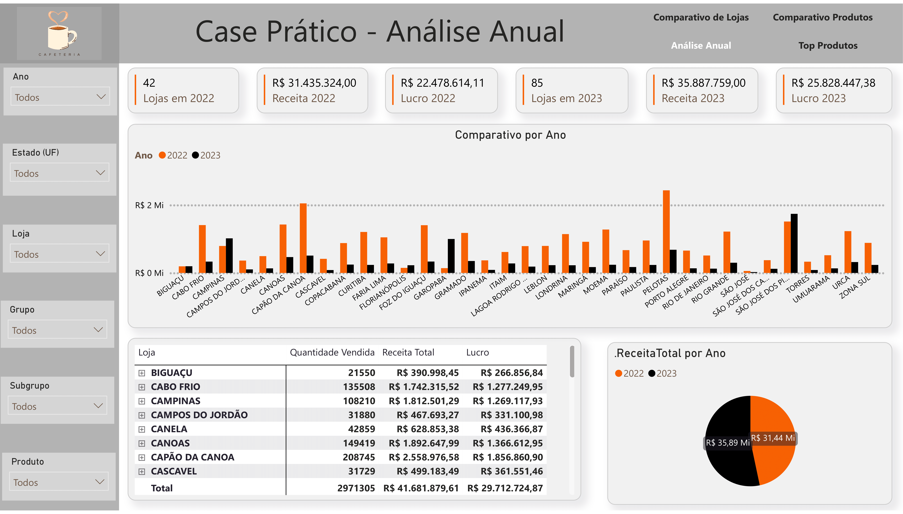

# 📈 Insights – Store Comparison Case

This document summarizes the key business insights derived from the Power BI dashboard.

---

## 🔹 Annual Overview

The company's store expansion strategy between 2022 and 2023 was successful, increasing the number of stores from 42 to 85 (+102%). As a result, revenue grew by **~14%**, and profit also rose significantly. 

However, when analyzing only the stores that operated in both years, **most of them recorded a revenue drop in 2023**. The overall growth was driven primarily by the opening of new locations. Without the expansion, the company would have faced a decline in revenue and profitability.

Cities such as Canoas, Capão da Canoa, and Porto Alegre stood out positively, while Torres and Umuarama had a sharp drop in 2023 and should be reviewed.

---

## 🔹 Store Comparison

Among all stores, **São José dos Pinhais** was the one that generated the most revenue in 2023, with a 4.6% share of total profit. The **average gross margin was 72%**, and states like SC, GO, and MG concentrated the highest revenues. The CMV (cost of goods sold) was well-controlled, with an average of 30.7%.

---

## 🔹 Product Comparison

The **best-selling products** were mostly coffee-based, with “Espresso com Leite” and “Espresso Longo” leading in revenue. The group “CAFÉS” represents more than 80% of sales. The average margin remained high (82%), and the cost structure was healthy (average CMV of 19.9%).

---

## 🔹 Top Products

The top 10 best-selling products are traditional items such as **Espresso com Leite**, **Água sem Gás**, and **Pão na Chapa**. On the other hand, **Suco de Acerola**, **Café Inglês**, and **Omelete Vegana** performed poorly and could be discontinued or repositioned. The data suggests opportunities to optimize the menu and align offerings with customer preferences.

---

> The final analysis also led to the suggestion of a new product line, which is detailed in the blog section of this portfolio.
