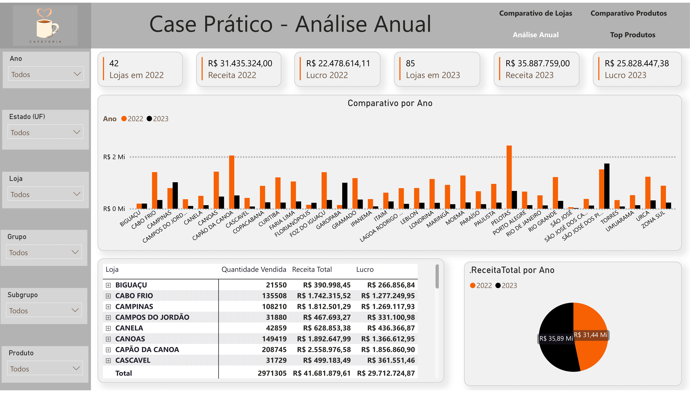
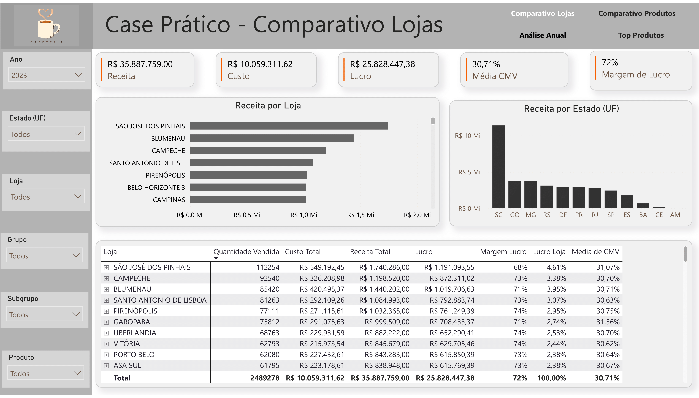
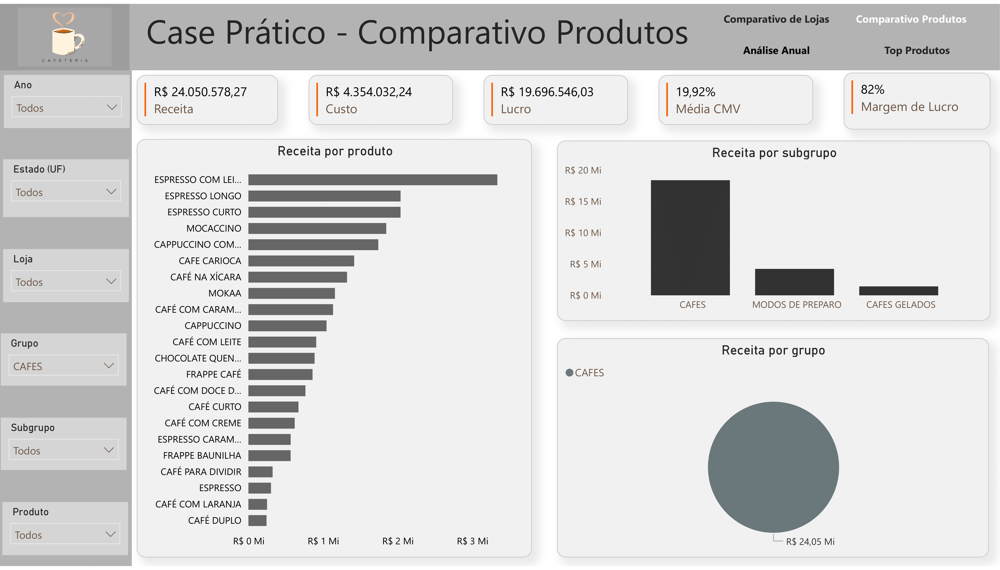
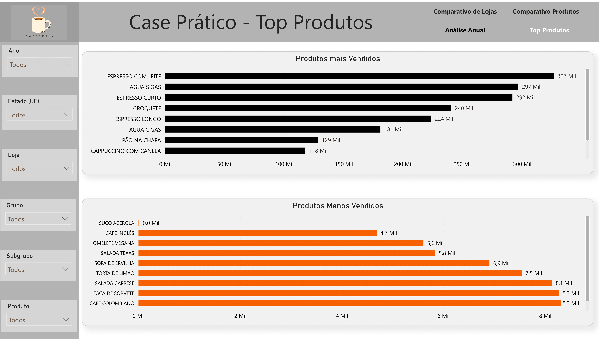

# 📈 Insights – Case Prático: Comparativo de Lojas

Este documento resume os principais insights de negócio obtidos a partir do dashboard em Power BI.

---

## 🔹 Visão Anual

A estratégia de expansão da rede entre 2022 e 2023 foi bem-sucedida, aumentando o número de lojas de 42 para 85 (+102%). Como resultado, a receita cresceu cerca de **14%**, com aumento expressivo também no lucro. 

Entretanto, ao analisar apenas as lojas que já operavam em ambos os anos, observa-se que **a maioria teve queda de receita em 2023**. O crescimento geral foi impulsionado principalmente pela **abertura de novas unidades**. Sem a expansão, a empresa teria apresentado prejuízo.

O crescimento foi mais notável em cidades do Sul como Canoas, Capão da Canoa e Porto Alegre. Já as lojas de Torres e Umuarama apresentaram queda acentuada e devem ser avaliadas.

---

## 🔹 Comparativo de Lojas

Entre todas as lojas, **São José dos Pinhais** foi a que gerou maior receita em 2023, com 4,6% de participação no lucro total. A **margem bruta média foi de 72%**, e estados como SC, GO e MG concentraram as maiores receitas. O CMV (Custo da Mercadoria Vendida) esteve bem controlado, com média de 30,7%.

---

## 🔹 Comparativo de Produtos

Os **produtos mais vendidos** foram em sua maioria à base de café, com destaque para “Espresso com Leite” e “Espresso Longo”. O grupo “CAFÉS” representa mais de 80% do faturamento. A margem média permaneceu elevada (82%) e a estrutura de custos saudável (CMV médio de 19,9%).

---

## 🔹 Top Produtos

Os 10 produtos mais vendidos incluem itens tradicionais como **Espresso com Leite**, **Água sem Gás** e **Pão na Chapa**. Por outro lado, produtos como **Suco de Acerola**, **Café Inglês** e **Omelete Vegana** tiveram desempenho baixo e podem ser descontinuados ou reposicionados. Os dados indicam oportunidades para otimizar o cardápio e alinhar a oferta com as preferências dos clientes.

---

> A análise final também levou à sugestão de uma nova linha de produto, detalhada na seção de blog deste portfólio.
